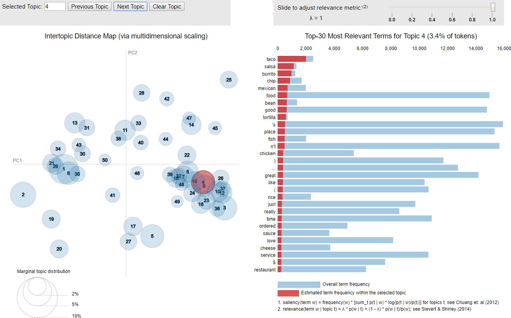
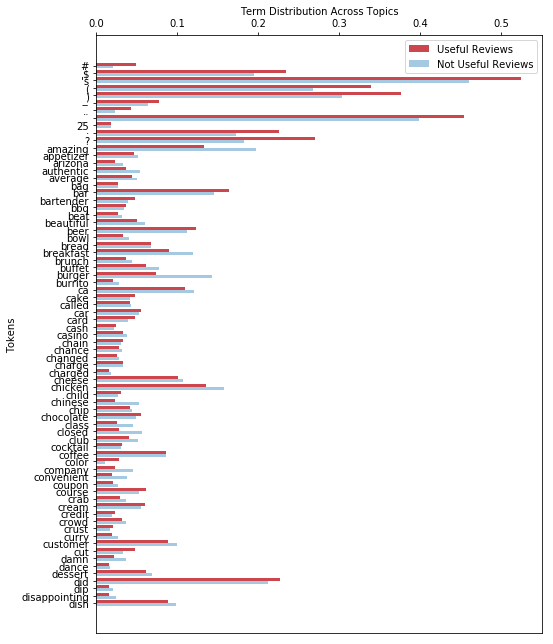
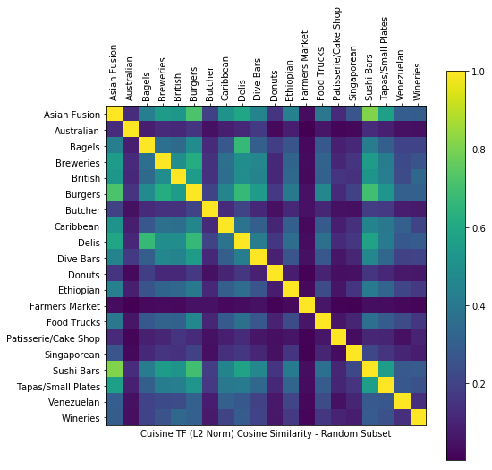
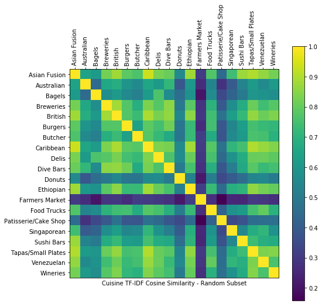
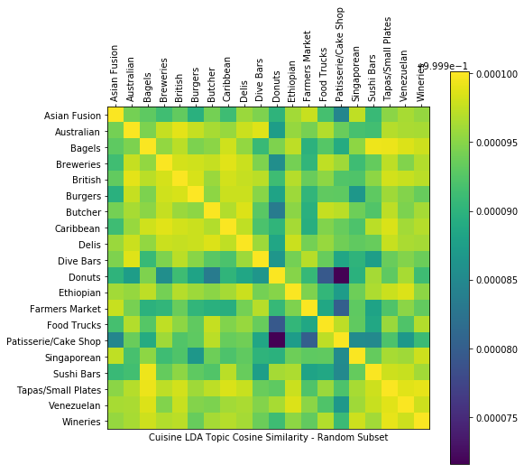
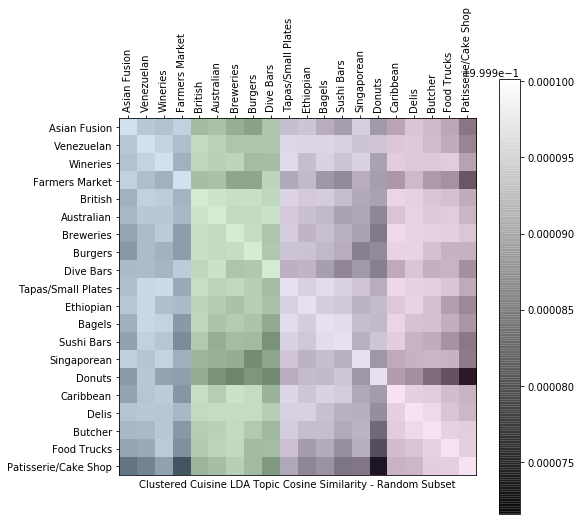

# Task 07: Final Report

loganjtravis@gmail.com (Logan Travis)

## Project Highlights

From course page [Week 6 > Final Report Information > Final Report Instructions](https://www.coursera.org/learn/data-mining-project/supplement/zo7WM/final-report-instructions):

> The highlights of your project, which should consist of three subsections corresponding to usefulness of results, novelty of exploration, and contribution of new knowledge, respectively.

I must apologize to you in advance. My "Novelty of Exploration" and "Contribution of New Knowledge" sections felt incredibly repetitive after writing the first section, "Usefulness of Result". I removed them. Please score me on "Novelty of Exploration" and "Contribution of New Knowledge" while reading the "Usefulness of Result" section below.

### Usefulness of Result

My mining project included two potentially useful results: 1) Using review text to inform a "cuisine guide" and 2) Understanding the limits of review text for prediction. Both leverage knowledge gained across multiple exercises most notably [Task 04: Rank Popular Dishes](#task-04-rank-popular-dishes), [Task 05: Recommend Restaurants by Dish](#task-04-recommend-restaurants-by-dish), and [Task 06: Predict Hygiene Inspection Results](#task-06-predict-hygiene-inspection-results). I detail the usefulness of my results from those tasks below and summarize the tasks themselves in the [Project Activities](#project-activities) section.

#### Exploring a New Cuisine

Yelp has proven itself an effective tool for consumers. It empowers their decision making about restaurants, shops, hotels, and other business. It also enables them to influence those businesses - ideally to improve them - by increasing access to their feedback.

Yet Yelp could do more. Many if not most reviewers write about more than the business they visited; they write about that business's services and products. In the case of restaurants, reviewers write about food revealing their opinions on dishes and cuisines.

I determined three uses for Yelp reviews while completing this mining capstone project. Combining them would enable Yelp to develop a "cuisine guide" for those exploring new cuisines:

1. **Programmatic cuisine identification:** Mined topics suggest types of businesses including clear and separate topics for most cuisines. See [Project Activities > Task 01: Initial Topic Investigation](#task-01-initial-topic-investigation) below. Modeling cuisines as topics would allow Yelp to programmatically classify new restaurants for their cuisines. It need only select the most probable topic(s) for a new restaurant's reviews.<br><br>The topics I found would need revision. They included non-cuisine topics like location (e.g., Las Vegas) and sentiment. I would also encourage Yelp to periodically retrain the model. Cuisines do not remain static so I anticipate their topic representation to change over time.

2. **Suggest and rank dishes for cuisines:** Frequent phrase mining from Yelp reviews yielded *some* dish names. See [Project Activities > Task 03: Mine Popular Dishes](#task-03-mine-popular-dishes) below. It also returned many non-dish frequent phrases. Unlike modeling cuisines as topics, mining phrases from review text would need human intervention to produce useful dish names.<br><br>Yelp could also use review text to rank dishes within cuisines. I employed a computationally simple and scalable method to rank dishes by scaling Yelp's normal [1, 5] star score to [-1, 1]. That adjustment allowed me to sum scaled score multiplied by review appearance for dishes in Mexican cuisine. Staple dishes like "burrito", "enchilada", and "guacamole" ranked high. See [Project Activities > Task 04: Rank Popular Dishes](#task-04-rank-popular-dishes) below.

3. **Rank the best restaurants to explore a cuisine:** Extending the ranked dishes to ranked restaurants for those dishes can similarly employ review text. See [Project Activities > Task 05: Recommend Restaurants by Dish](#task-04-recommend-restaurants-by-dish) below. I used the same scaled star score and multiplied by a each restaurant's dish distribution. Yelp could add dimensions for location, operating hours, and other common search criteria to create an interactive guide for people trying to find the best local restaurant to experience a new cuisine.

#### Understanding the Limits of Review Text

Building a "cuisine guide" from reviews sounds like a great opportunity for Yelp. It has limits though. I identified at least two in the mining exercises for this project:

1. **A single review mixes multiple topics:** Topics identifying business type pervaded my LDA results as noted in item one above. Modeling cuisines as topics is therefore a viable method and one requiring minimal human intervention. Note *minimal* human intervention. Both [Task 01: Initial Topic Investigation](#task-01-initial-topic-investigation) and [Task 02: Cuisine Map](#task-02-cuisine-map) exhibited results that a strict cuisine-generated model of reviews can not explain:

  * Several topics in task one related to location and sentiment.
  *  Attempting to map expert-labeled cuisines to mined topics "flattened" the topics so significantly that maximum cosine similarity dropped to 0.0001.

  <br>I explain those behaviors as arising from "noise". Reviews do not contain only descriptions of food and cuisine. Many may not contain a predominant amount of text relating to food and cuisine. Quality of service, price, location, popularity, and other dimensions all comingle to produce useful reviews.

2. **Review text makes a poor predictor:** As a result of those comingled topics, review text does not perform well for prediction. See [Project Activities > Task 06: Predict Hygiene Inspection Results](#task-06-predict-hygiene-inspection-results) below. My best model scored only 0.674419 for F1 and I saw similar results with my peers. Interestingly, that model employed a simple logistic regression. More advanced algorithms like K-Nearest Neighbor, Random Forest, and Naïve Bayes scored worse. That unusual result prompted me to ask two questions:

  * What expertise do reviewers have in restaurant hygiene?
  * How do reviews relate temporarily to business events (like a hygiene inspection)?

  <br>I could not answer either question with the Yelp data. I *could* imagine additional features that would help answer those questions like reviewer profession and review date. Their absence illustrates another limitation of review text for prediction: Singular intent. Reviewers write to inform other consumers. They do not write to notify health inspectors. They do not write to bankers concerned with loan repayment. They do not write to kitchen appliance vendors interested in when a restaurant will upgrade its aging stoves. We can expect that any predictive value beyond "Will people appreciate this business?" risks drowning in the noise of reviewers informing other consumers.

### Novelty of Exploration

Please see the [Usefulness of Result](#usefulness-of-result) section above.

### Contribution of New Knowledge

Please see the [Usefulness of Result](#usefulness-of-result) section above.

## Practical Use

From course page [Week 6 > Final Report Information > Final Report Instructions](https://www.coursera.org/learn/data-mining-project/supplement/zo7WM/final-report-instructions):

> A brief discussion of what has to be done in order to make your data mining results really useful to people (i.e., building a practically useful system to help people make dining decisions).

Developing a production "cuisine guide" would take several improvements over my investigative model:

* **Context-sensitive review text representation:** I employed two text representations of review text, a binary appeared / did not appear in review indicator for dishes and a probability distribution of dish mentions across each restaurant's combined reviews. Those representations worked well. However, they require assuming the review score applies to the dishes mentioned in the review.<br><br>I found recent research into extracting the opinion for target words in text. See Shuai Wang, Mianwei Zhou, Sahisnu Mazumder, Bing Liu, Yi Chang, "[Disentangling Aspect and Opinion Words in Target-based Sentiment Analysis using Lifelong Learning](https://arxiv.org/abs/1802.05818)", 16 February 2018. Extracting the opinion about dishes, not just the score for the entire review, would greatly improve recommendations from the "cuisine guide".

* **Additional dimensions:** End users would not benefit from a *global* list of the best restaurants to experience a chosen cuisine. Yelp would need to add dimensions to aid users searching for their local restaurants, preferably those open during hours those users intend to visit and with other desirable traits like easy parking.

* **User-driven interface:** My charts in [Task 05: Recommend Restaurants by Dish](#task-04-recommend-restaurants-by-dish) looked good. Yet I would not expect a modern user to appreciate a static chart. Yelp would want to add interactive elements such as clicking a restaurant name to open its review page. Yelp would might also want to recommend cuisines to try based on the ratings of local restaurants compared to a national / global average. End users might want to experience Ethopian food but listing the best Ethopian restaurants in a [PhinDeli Town Buford, WY](https://en.wikipedia.org/wiki/PhinDeli_Town_Buford,_Wyoming) (the least populous city in the U.S.) would not lead to a good experience.

## Project Activities

From course page [Week 6 > Final Report Information > Final Report Instructions](https://www.coursera.org/learn/data-mining-project/supplement/zo7WM/final-report-instructions):

> A summary of your project activities, which can be simply a compressed combination of all your individual task reports.

### Task 01: Initial Topic Investigation

* Cleaned Yelp Review data
* Calculated TF-IDF (after lemmatizing and stemming) on a 30% random sample
* Found topics using Latent Dirichlet Allocation
  * Most topics suggest a type of business such as hotel or Mexican restaurant
  * Example using [pyLDAvis package](https://github.com/bmabey/pyLDAvis):<br>
* Split reviews along into useful (>0 votes for useful) versus not useful (0 votes for useful) score to compare topics  
  * The not useful reviews included both low-utility *and semantic* words as a higher proportion of their topic distributions
  * Visual:<br>

### Task 02: Cuisine Map

* Compared cuisine similarity by analyzing restaurant review text
* Initially calculated cosine similarity for TF
  * Many cuisines appear strongly dissimilar using this simple comparison (see dark bands below)
  * Visual:<br>
* Improved comparison by applying IDF before calculating cosine similarity
  * "Document" in IDF means a virtual document concatenating all reviews for a cuisine
  * Visual:<br>
* Attempted to improve comparison by mining topics using LDA
  * Unfortunately, this excessively "flattened" the cosine similarity with a peak value of 0.0001
  * Visual:<br>
* Found groups of similar cuisines by applying K-Means clustering
  * Clustering improves the comparison but still exhibits odd results like grouping "Asian Fusion", "Venezuelan", "Wineries", and "Farmers Market"
  * Visual:<br>

### Task 03: Mine Popular Dishes

* Manually cleaned provided list of Mexican dishes
  * Found an excessive proportion of non-dishes
  * Suggested initial phrase mining yielded poor results
* Added dishes from [Wikipedia page for "List of Mexican dishes"](https://en.wikipedia.org/wiki/List_of_Mexican_dishes)
  * Referred to as "distant expert" labeling by the [AutoPhrase](https://github.com/shangjingbo1226/AutoPhrase)'s authors \[1\]\[2\]
  * Increased the initial list of 25 dishes to 242
* Attempted to find more dishes with [AutoPhrase](https://github.com/shangjingbo1226/AutoPhrase)
  * Fed known dish labels into the mining algorithm to improve results...
  * ...but found them only marginally useful with the most frequent phrases overwhelmed by non-dishes:

|"dish"|score|
|:---|---:|
|fort apache|0.986563|
|crescent ballroom|0.986338|
|sin city|0.985787|
|tivoli village|0.985641|
|sky harbor|0.98562|

### Task 04: Rank Popular Dishes

* Initially ranked Mexican dishes by review appearances
  * "Appearance" only counts the first use of a cuisine in a review; multiple uses in a single review do not count to minimize variance due to reviewer sentiment, writing style, etc.
  * Visual:<br>
* Adjusted rank by review stars
  * Point scale adjusted from [1, 5] to [-1, 1] such that low scoring reviews reduce a dish's popularity
  * Visual:<br>

### Task 05: Recommend Restaurants by Dish

* Initially ranked restaurants by calculating the proportion of dish appearances in each restaurant's reviews
  * This simple approach leads to restaurants with few reviews can achieve 100% review appearances for a single dish
  * Visual:<br>
* Adjusted rank by review Stars
  * As in ranking dishes, point scale adjusted from [1, 5] to [-1, 1] such that low scoring reviews reduce a dish's popularity for a specific restaurant
  * Visual:<br>
* Visualized top ranking restaurants and dishes:<br>

### Task 06: Predict Hygiene Inspection Results

* Employed multiple text representations and predictive models to determine whether a restaurant would fail its next hygiene inspection
  * Text representations included:
    * Unigram probability (*not* TF-IDF due to concatenation of all reviews for each restaurant)
    * Recursive Feature Reduction ([`RFE` on SciKit Learn](http://scikit-learn.org/stable/modules/generated/sklearn.feature_selection.RFE.html#sklearn.feature_selection.RFE.get_support)) of unigrams
    * Latent Symantic Analysis ([`TruncatedSVD` in SciKit Learn](http://scikit-learn.org/stable/modules/generated/sklearn.decomposition.TruncatedSVD.html#sklearn.decomposition.TruncatedSVD)) of unigrams
    * Frequent phrases (up to trigram) with and without LSA
  * Predictive models included:
    * Logistic Regression
    * K-Nearest Neighbor
    * Random Forest
    * Naïve Bayes
* Interestingly, LSA of unigrams fed into logistic regression performed better than all other models:

```
Model 03: Latent Symantic Analysis of Unigram Frequency Before Logistic Regression
-----
F-1 Score: 0.674419
True Negatives: 50
True Positives: 58
False Negatives: 28
False Positives: 28
```

## AutoPhrase Publications

[AutoPhrase](https://github.com/shangjingbo1226/AutoPhrase) arose form the contributions of two publications:

1. Jingbo Shang, Jialu Liu, Meng Jiang, Xiang Ren, Clare R Voss, Jiawei Han, "[Automated Phrase Mining from Massive Text Corpora](https://arxiv.org/abs/1702.04457)", accepted by IEEE Transactions on Knowledge and Data Engineering, Feb. 2018.
2. Jialu Liu*, Jingbo Shang*, Chi Wang, Xiang Ren and Jiawei Han, "[Mining Quality Phrases from Massive Text Corpora](http://hanj.cs.illinois.edu/pdf/sigmod15_jliu.pdf)”, Proc. of 2015 ACM SIGMOD Int. Conf. on Management of Data (SIGMOD'15), Melbourne, Australia, May 2015. (* equally contributed, [slides](https://www.microsoft.com/en-us/research/wp-content/uploads/2016/02/sigmod15SegPhrase.pdf))
